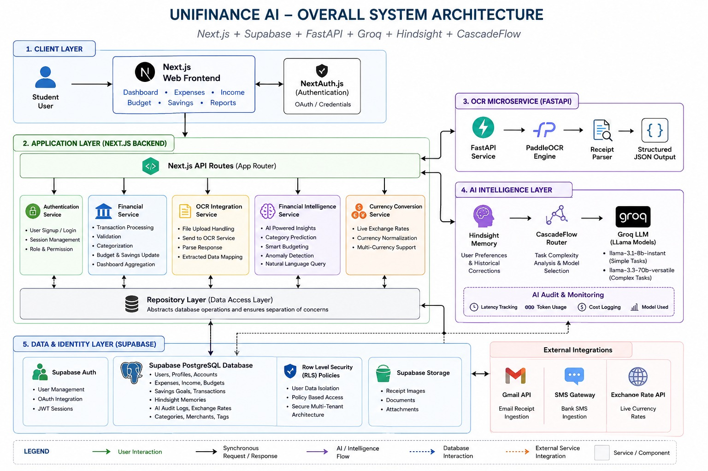
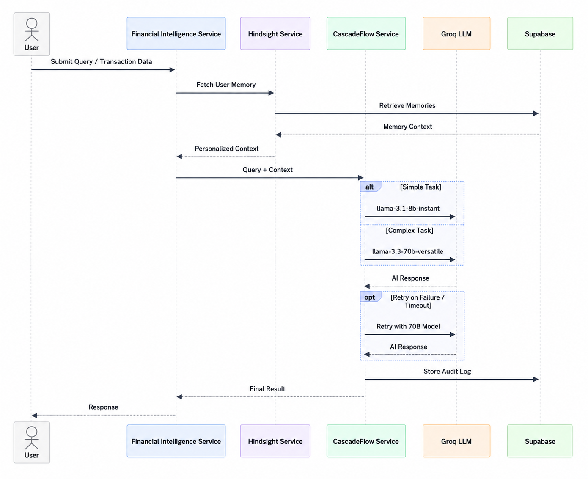
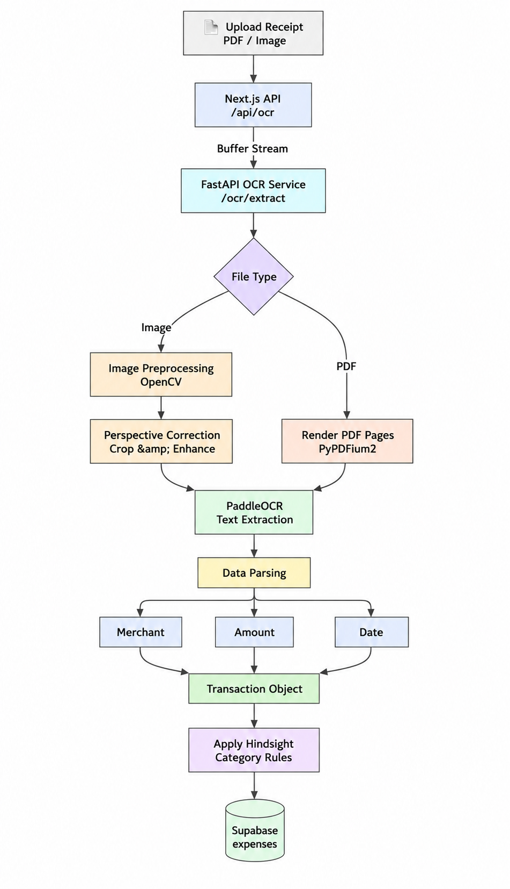
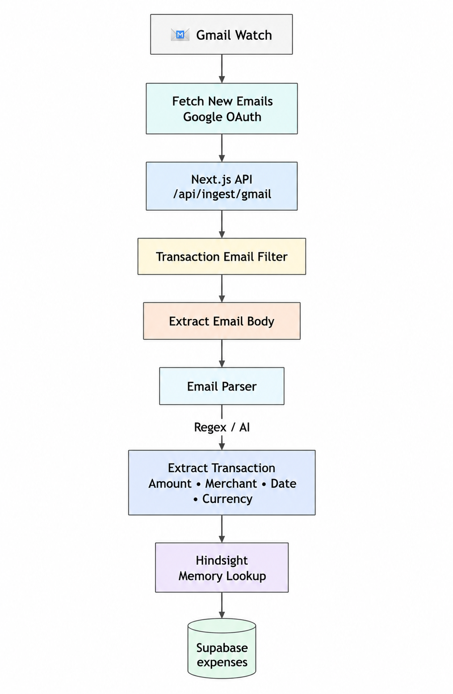
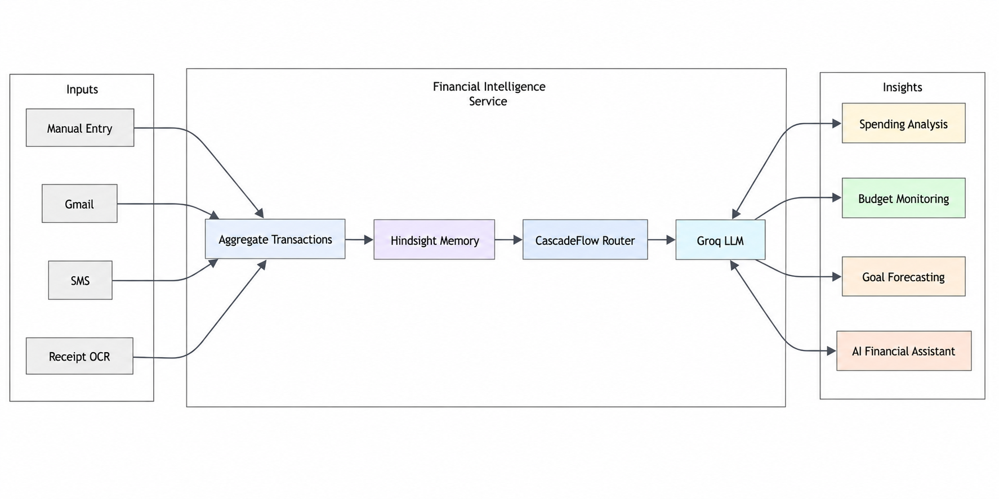
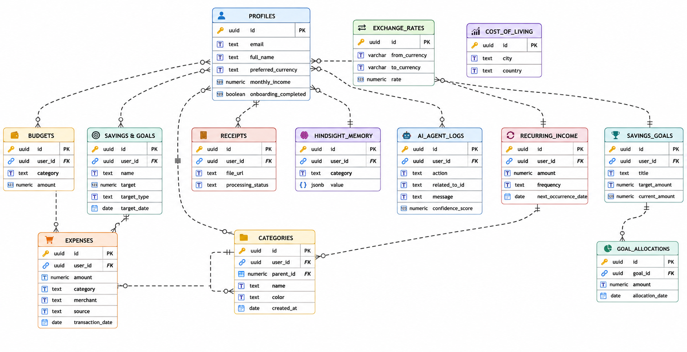

# UniFinance AI

### AI-Powered Financial Intelligence Platform for International Students

---

[](https://nextjs.org/)
[](https://fastapi.tiangolo.com/)
[](https://supabase.com/)
[](https://groq.com/)
[](https://github.com/vectorize-io/hindsight)
[](https://github.com/lemony-ai/cascadeflow)
[](https://next-auth.js.org/)
[](https://opensource.org/licenses/MIT)

---

## 📖 Table of Contents

1. [About UniFinance AI](#-about-unifinance-ai)
2. [The Problem & The Solution](#-the-problem--the-solution)
3. [Architecture Diagrams & Core Flows](#%EF%B8%8F-architecture-diagrams--core-flows)
    * [3.1 Overall System Architecture](#31-overall-system-architecture)
    * [3.2 Hindsight + CascadeFlow Routing](#32-hindsight--cascadeflow-routing)
    * [3.3 OCR Receipt Ingestion Pipeline](#33-ocr-receipt-ingestion-pipeline)
    * [3.4 Email Transaction Ingestion Pipeline](#34-email-transaction-ingestion-pipeline)
    * [3.5 Financial Intelligence Flow](#35-financial-intelligence-flow)
    * [3.6 Database Architecture](#36-database-architecture)
    * [3.7 Dashboard Data Flow](#37-dashboard-data-flow)
4. [Key Features Breakdown](#-key-features-breakdown)
5. [AI Intelligence Layer](#-ai-intelligence-layer)
6. [Advanced OCR Processing Engine](#-advanced-ocr-processing-engine)
7. [Technology Stack](#-technology-stack)
8. [Enterprise Security & RLS Isolation](#-enterprise-security--rls-isolation)
9. [Product Roadmap](#-product-roadmap)
10. [Local Installation & Setup](#-local-installation--setup)

---

## 🌟 About UniFinance AI

**UniFinance AI** is a state-of-the-art, production-ready, AI-driven SaaS platform designed to solve the unique financial complexities of international students. By combining real-time multi-currency support, local cost of living indexing, automated document ingestion, and cognitive personal finance modeling, the platform enables students to seamlessly navigate financial transition across borders.

---

## ⚖️ The Problem & The Solution

### 🚩 The Business Problem

International students encounter immediate and challenging financial hurdles:

* **Fragmented Transaction Channels**: Juggling physical cash receipt uploads, banking apps in multiple countries, and subscription bills.
* **Cost of Living Disconnect**: Navigating significant differences in prices between home cities and host universities without local context.
* **Currency Variance**: Dealing with constant currency conversion variables when receiving financial support in their home currency while paying rent and utilities in their destination currency.
* **Friction in Ingestion**: Manually entering numbers leads to administrative fatigue, resulting in unmonitored savings goals and budget leaks.

### 🛡️ The Solution

UniFinance AI brings order to this chaos through a single unified portal that automates:

* **Automated Data Ingestion**: Pulls raw transaction logs directly from uploaded receipt files (via PaddleOCR) and digital email receipts (via Google Workspace API integrations).
* **Multi-Currency Reconciliation**: Standardizes every entry by persisting both the transaction currency values and the converted host university currency based on real-time daily exchange rate schedules.
* **Predictive Budgeting**: Uses historical memory to auto-adjust spending limits, detect overspending, and suggest goal allocations.
* **Living Affordability Analytics**: Translates relative spending against city-by-city indices to help students forecast relocation costs.

---

## 🏗️ Architecture Diagrams & Core Flows

This section contains visual architectural representations showing data movement and service interactions.

### 3.1 Overall System Architecture

The overall system is designed as a decoupled web ecosystem linking a client application (Next.js), a specialized image computing daemon (FastAPI OCR), and a serverless security database (Supabase).



* **Next.js Web Client**: Serves a Single-Page App dashboard with interactive analytics, forms, and custom financial alerts.
* **FastAPI OCR Engine**: Serves raw REST endpoints for image preprocessing and optical text extraction.
* **Supabase PostgreSQL**: Manages database tables, real-time events, and Row-Level Security.
* **Specialized Services**: Routes logical processes to NextAuth.js (Auth), Groq (AI Reasoning), or Google Gmail APIs.

---

### 3.2 Hindsight + CascadeFlow Routing

This layer optimizes LLM reasoning costs, query latency, and response accuracy by retrieving user preference parameters and dynamically routing requests based on complexity.



* **Hindsight Service**: Queries the user's historical category adjustments to inject custom memory rules.
* **CascadeFlow Selection**: Evaluates query requirements. Simple requests (e.g. standard category sorting) are sent to `llama-3.1-8b-instant` for ultra-fast, cheap processing, while complex tasks (e.g. cross-account forecasting) route to `llama-3.3-70b-versatile`.
* **Escalation Logic**: If the fast model times out, CascadeFlow escalates the request to the high-capacity model.

---

### 3.3 OCR Receipt Ingestion Pipeline

Ingests visual receipt files (PDF/Image) via browser upload and creates transaction entries in Supabase.



* **Image Normalization**: Next.js sends files to FastAPI, where OpenCV applies CLAHE (contrast equalization), perspective warping, and auto-cropping.
* **PaddleOCR Extraction**: Text detections are extracted and sent through heuristic pattern parsers.
* **Transaction Formulation**: Compiles the parsed Merchant, Amount, Currency, and Date, applies Hindsight custom overrides, and logs the expense record.

---

### 3.4 Email Transaction Ingestion Pipeline

Retrieves, filters, and parses inbox receipt confirmations automatically.



* **Gmail API Poller**: Authenticates via Google OAuth, watching for new messages.
* **Filter Engine**: Checks headers and transaction terms (e.g. "order confirmed", "invoice").
* **Extraction Parser**: Uses RegEx and LLM helpers to extract the Amount, Date, and Merchant.
* **Category Resolver**: Saves categorized expenses directly to the database.

---

### 3.5 Financial Intelligence Flow

Illustrates how transaction data feeds the reasoning engines to produce personalized insights.



* **Data Aggregation**: Aggregates manual inputs, email sync, and receipt scans.
* **Insight Synthesis**: Evaluates budget status and goals progress.
* **Actionable Outputs**: Delivers forecasting vectors and recommendations to reduce overspending.

---

### 3.6 Database Architecture

The relational database architecture is built on Supabase PostgreSQL. Below is the Entity-Relationship mapping showing structural relationships and key references.



* **Profile & Identity**: `profiles` extends `auth.users` through triggers.
* **Transactional Records**: `expenses` logs core transaction items, which reference `profiles` and optional `recurring_expenses` structures.
* **Income Log**: `incomes` captures salary logs, optionally linked to `recurring_income_schedules`.
* **Budgeting & Savings**: `budgets` sets limits. `savings_goals` monitors savings targets and connects to `goal_allocations`.
* **Lookup Systems**: Global static schemas (`cost_of_living` and `exchange_rates`) provide lookup support.

---

### 3.7 Dashboard Data Flow

Standardizes currency representation and updates analytics in real time.


* **Ingestion Streams**: Combines income streams, expenses, and goals.
* **Dashboard Aggregation**: Calculates analytics metrics and formats graphs.
* **Visual Rendering**: Renders currency indicators and progress metrics in a responsive dashboard.

---

## 📊 Key Features Breakdown

| Feature Category | Core Capability | Technical Implementation |
| :--- | :--- | :--- |
| **Expense Management** | Automated Receipt Logging | Supports manual transaction forms, visual OCR uploads, and webhook sync for SMS/Email inboxes. |
| **Income Management** | Dual-Stream Influx Tracker | Tracks freelance, salary, scholarships, and schedules future automated income events. |
| **Budget Management** | Overspend Warnings | Allows setting limits by category and triggers overspending alerts when approaching limits. |
| **Savings Tracker** | Smart Target Goal Allocation | Allocates surplus cash to custom goals (e.g., tuition, rent deposit) and tracks progress. |
| **Analytics Engine** | Cash Flow Visualizations | Renders interactive spending trends, income vs. expense comparisons, and allocation histories. |
| **Currency Conversion**| Real-Time Currency Standardization | Stores original amounts alongside converted amounts using daily exchange rates synced via `pg_cron`. |
| **City Cost Index** | Relocation Planning Helper | Compares cost metrics (food, rent, transport) across major study destinations (Sydney, Perth, London, Toronto, NY, etc.). |

---

## 🧠 AI Intelligence Layer

UniFinance AI uses an advanced cognitive AI architecture to turn raw transaction data into actionable financial advice.

### 1. Hindsight Memory (Long-term Personal Context)

Traditional LLM finance trackers evaluate every query in isolation. UniFinance AI uses the **Hindsight Memory** store, which logs category corrections, spending anomalies, and goals progress.

* When a user manually corrects a category classification, the correction is saved to the database.
* Future OCR queries, email updates, and chat assistant queries load these rules to personalize output.
* *Example*: If a student categorizes Amazon Books as `Education` instead of `Shopping`, Hindsight injects this context to auto-correct all subsequent Amazon transactions.

> 🔗 **Resources & References**: [GitHub Repository](https://github.com/vectorize-io/hindsight) | [Official Documentation](https://hindsight.vectorize.io/) | [What is Agent Memory? (Vectorize)](https://vectorize.io/what-is-agent-memory)

### 2. CascadeFlow Runtime Router

To balance latency, API costs, and performance, the application uses **CascadeFlow**:

* **Task Evaluation**: Evaluates incoming queries as simple (category mapping) or complex (forecasting).
* **Model Selection**: Routes simple queries to `llama-3.1-8b-instant` and complex queries to `llama-3.3-70b-versatile`.
* **Speculative Escalation**: If the lightweight model fails or times out, CascadeFlow escalates the request to the high-capacity model.
* **Audit Trail**: Every request details latency times, token usage, and dollar costs inside `ai_audit_logs`.

> 🔗 **Resources & References**: [GitHub Repository](https://github.com/lemony-ai/cascadeflow) | [Official Documentation](https://docs.cascadeflow.ai/)

### 3. Groq AI Core Reasoning

Groq provides ultra-fast LLM inference, serving as the cognitive engine for:

* Interactive financial advice and budget analysis.
* Spotting budget risks and explaining them in natural language.
* Projecting savings targets based on historical spending habits.
* *Note: Computational math and currency conversion are handled by PostgreSQL for accuracy.*

---

## 📷 Advanced OCR Processing Engine

```
User Upload -> Next.js /api/ocr -> FastAPI /ocr/extract -> OpenCV Preprocess -> PaddleOCR -> Heuristics -> Next.js -> Supabase
```

The system includes a dedicated Python FastAPI service running PaddleOCR:

* **Image Normalization**: Uses OpenCV to warp perspective, deskew, auto-crop boundaries, and apply CLAHE (contrast equalization) to fix poor lighting.
* **Why PaddleOCR?**: Selected for its fast inference times, high accuracy for multilingual characters, lightweight package footprint, and efficiency on CPU hardware.
* **Heuristics Parser**: Extracts fields like the merchant, transaction date formats (e.g., `YYYY-MM-DD`, `DD/MM/YY`), currency symbols, and numeric totals.

---

## 💻 Technology Stack

* **Frontend**: Next.js 15 (App Router, React, TypeScript), Vanilla CSS Custom Variables, Recharts
* **Backend API**: Node.js Next.js Serverless Routes, FastAPI (Python 3.10)
* **AI Routing**: Groq SDK, Hindsight memory context services, CascadeFlow runtime engines
* **OCR & Computer Vision**: OpenCV Headless, PaddleOCR, PyPDFium2
* **Database & Auth**: Supabase PostgreSQL (RLS, schema functions), Supabase Storage, NextAuth.js
* **Automation**: `pg_cron`, `pg_net` async triggers

---

## 🔒 Enterprise Security & RLS Isolation

Data privacy is protected through strict security policies:

1. **Row-Level Security (RLS)**: Active on all user tables. Authenticated users can only interact with rows matching their user ID:

   ```sql
   ALTER TABLE public.expenses ENABLE ROW LEVEL SECURITY;
   CREATE POLICY "Users can manage own expenses" ON public.expenses
     FOR ALL TO authenticated USING (auth.uid() = user_id) WITH CHECK (auth.uid() = user_id);
   ```

2. **Storage Isolation**: The Supabase `receipts` storage bucket restricts reads and writes using policies that verify user identity:

   ```sql
   bucket_id = 'receipts' AND (storage.foldername(name))[1] = auth.uid()::text
   ```

3. **API Integrity**: Integrations are secured via OAuth, and NextAuth sessions are verified on server-side Next.js route boundaries.

---

## 🗺️ Product Roadmap

* [ ] **Voice Financial Assistant**: Hands-free transaction logging using speech-to-text.
* [ ] **AI Spending Coach**: Proactive alerts when spending trends indicate budget risks.
* [ ] **Scholarship Directory**: Automatically matching student profiles to active scholarship openings.
* [ ] **Collaborative Budgeting**: Share rent and expense logs with roommates securely.
* [ ] **Financial Health Scoring**: Gamified financial wellness score for students.

---

## ⚙️ Local Installation & Setup

### Prerequisites

* Node.js (v18+)
* Python 3.10
* Supabase CLI / Active Supabase instance
* Groq API Key

### 1. Setup Next.js Frontend

```bash
# Clone the repository
git clone https://github.com/your-repo/unifinance-ai.git
cd unifinance-ai

# Install dependencies
npm install

# Create .env.local and add configuration
cp .env.example .env.local
```

### 2. Setup FastAPI OCR Microservice

```bash
cd ocr-backend

# Install virtualenv and packages
python3 -m venv venv
source venv/bin/activate
pip install -r requirements.txt

# Start FastAPI server on port 8000
uvicorn main:app --port 8000 --reload
```

### 3. Run Dev Server

```bash
# In the project root
npm run dev
```

---

## 💡 Why UniFinance AI?

UniFinance AI is built specifically for international students, combining expense tracking, AI insights, and city cost data in one easy-to-use platform. By automating data ingestion and handling currency conversions behind the scenes, it simplifies personal finance management and helps students build healthy financial habits abroad.
