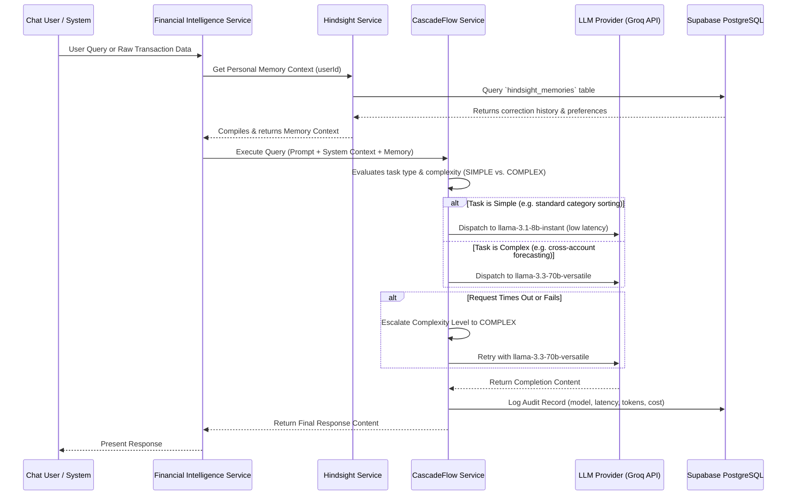
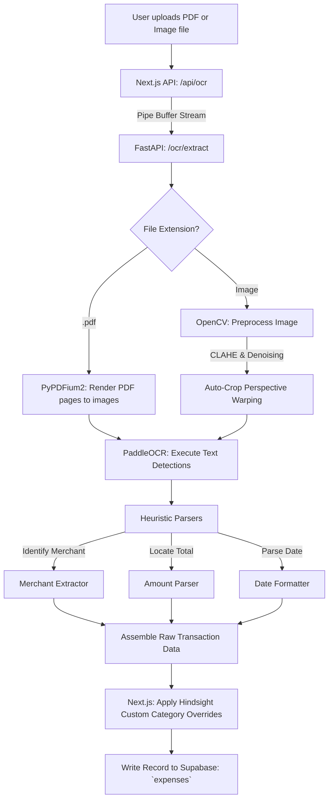
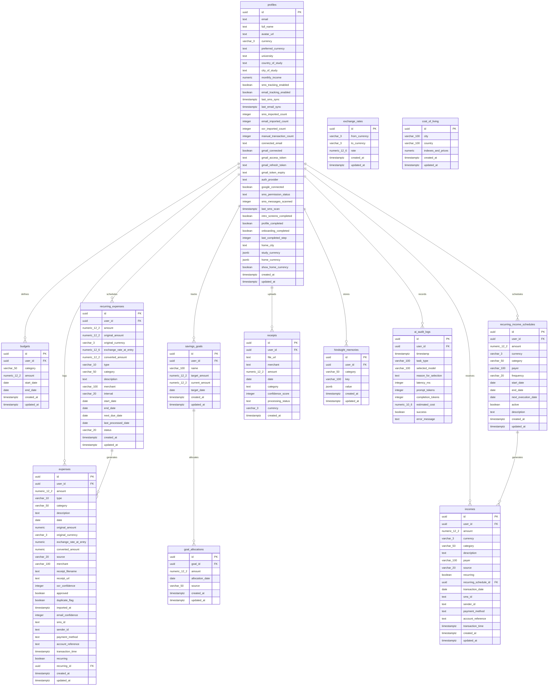

# Technical Architecture Guide: UniFinance Expense Tracker

This document describes the architectural layers and data ingestion pipelines of the **UniFinance Expense Tracker** ecosystem. It provides comprehensive specifications and Mermaid.js diagrams for each system.

---

## 1. System Architecture

The overall system is designed as a decoupled, event-driven web application utilizing Next.js for client and web API logic, Supabase for data layer services, and a dedicated FastAPI Python service for compute-heavy document processing.

```mermaid
graph TD
    subgraph Client Layer
        A[Next.js Web Frontend] -->|OAuth/Credentials| B[NextAuth.js Client]
        A -->|React Financial Context| C[Financial Data Provider]
    end

    subgraph API & Backend Logic (Next.js Node Server)
        D[Next.js App API Routes] -->|Reads / Writes| E[Repositories Layer]
        D -->|Invokes Services| F[Services Layer]
    end

    subgraph Data & Identity Layer (Supabase)
        G[(Supabase PostgreSQL Database)]
        H[Supabase Auth Service]
        I[Row-Level Security RLS Policies]
        G --- I
        H --- I
    end

    subgraph Specialized Microservices
        J[FastAPI OCR Service]
    end

    %% Communications
    A -->|GraphQL/REST API Calls| D
    B -->|Validates Sessions| H
    E -->|Database Query Protocols| G
    F -->|HTTP POST| J
```

### Key Components:
1. **Next.js App Router (Frontend)**: Serves a single-page dashboard with interactive analytics, forms, and financial alerts.
2. **Supabase PostgreSQL & Auth**: Handles secure, real-time database transactions, row-level security (RLS) policies, and user onboarding tables.
3. **FastAPI OCR Engine**: Serves raw REST endpoints for image manipulation and OCR processing.

---

## 2. Hindsight Memory & CascadeFlow LLM Routing

This architecture optimizes LLM reasoning costs, query latency, and personalizes responses using user-specific historical correction patterns.



* **Hindsight Service**: Provides long-term memory capabilities. When a user changes an OCR prediction, it creates/updates a row in `hindsight_memories` (under category `ocr_learning`), mapping the merchant to their corrected choice.
* **CascadeFlow Service**: Manages API resilience and resource limits. Uses speculative escalation (dynamically upgrading model capacity when the lightweight model fails or exceeds a 15-second response window) and commits cost audit trails into `ai_audit_logs`.

---

## 3. Data Ingestion Pipelines

The system supports three major ingestion avenues to capture and process transactions.

### Pipeline 1: OCR Receipt Ingestion Pipeline

Ingests visual receipt files (PDF/Image) via browser upload.



---

### Pipeline 2: SMS Integration Ingestion Pipeline

Captures banking transaction alerts sent via SMS messaging.

```mermaid
flowchart TD
    A[Mobile Device: Incoming Bank Transaction SMS] --> B[SMS Sync Daemon / Webhook Router]
    B -->|POST Payload| C[Next.js API: /api/ingest/sms]
    C --> D[SMS Parser Service]
    D --> E{Match Pattern Rules?}
    
    E -->|No Match| F[Log Ignored / Unmatched Format]
    E -->|Matched| G[Extract Amount, Merchant, Currency, Account Reference]
    
    G --> H[Query Hindsight Custom Merchant Catalog]
    H --> I[Assign Expense Category]
    I --> J[Save Record to Supabase: `expenses` (Source: SMS)]
```

---

### Pipeline 3: Gmail Integration Ingestion Pipeline

Scans user email inboxes for transaction receipts and payment confirmations.

```mermaid
flowchart TD
    A[Gmail API Watch / Polling Trigger] --> B[Fetch New Messages via Google OAuth]
    B --> C[Next.js API: /api/ingest/gmail]
    C --> D[Filter emails by transaction terms & headers]
    D --> E[Extract HTML or Plaintext message body]
    
    E --> F[Email Parsing engine]
    F -->|Regex / LLM Helper| G[Extract Amount, Merchant, Date, Currency]
    
    G --> H[Check Hindsight Memory]
    H --> I[Save Record to Supabase: `expenses` (Source: EMAIL)]
```

---

### Pipeline 4: Financial Intelligence Flow

Processes raw data inputs through cognitive memory and router instances to produce spending recommendations and goal allocations.

```mermaid
flowchart TD
    subgraph Input Sources
        A[Manual Entry]
        B[Gmail Ingestion]
        C[SMS Sync]
        D[OCR Receipt Ingestion]
    end

    subgraph Core Processing (Financial Intelligence Service)
        E[Aggregate Transaction Data]
        F[Fetch Hindsight Memory Context]
        G[CascadeFlow Routing Decision]
        H[Groq LLM Reasoning Execution]
    end

    subgraph Analytical Outputs
        I[Spending Habits Analysis]
        J[Budget Utilization & Overspend Alerts]
        K[Savings Goal Allocations & Forecasting]
        L[Natural Language Copilot Response]
    end

    A & B & C & D --> E
    E --> F
    F --> G
    G --> H
    H --> I & J & K & L
```

---

### Pipeline 5: Dashboard Data Flow

Standardizes multi-currency logs and computes real-time budget and savings goal metrics for the presentation layer.

```mermaid
flowchart TD
    subgraph Data Layers (Supabase Database)
        A[(Profiles Table: home_currency, preferred_currency)]
        B[(Expenses Table: original_amount, original_currency)]
        C[(Incomes Table: amount, currency)]
        D[(Savings Goals Table: target_amount, current_amount)]
        E[(Exchange Rates Table: current rates)]
    end

    subgraph Aggregation Layer (Next.js Node Server / Context)
        F[Currency Normalization Engine]
        G[Date-Based Transaction Aggregator]
        H[Budget Limit Calculator]
        I[Savings Goals Delta Evaluator]
    end

    subgraph Presentation Layer (Next.js React Client)
        J[Financial Data Provider Context]
        K[Recharts Spend Trends Widget]
        L[Budget Health Alerts Banner]
        M[Unified Student Financial Overview Dashboard]
    end

    A & B & C & D & E --> F
    F --> G
    G --> H
    H --> I
    I --> J
    J --> K & L --> M
```

---

## 4. Database Architecture

The UniFinance Expense Tracker uses **Supabase (PostgreSQL)** as its core data store. The database layer uses Row-Level Security (RLS) policies for user data isolation, database triggers to automate timestamping and profile initialization, and the `pg_cron` extension to automate background system activities.

### 4.1 Entity-Relationship Diagram (ERD)

The diagram below represents the tables, their primary/foreign key connections, and relationships in the database:



### 4.2 Database Tables Specification

#### 4.2.1 Core User Tables

* **`profiles`**: Extends the default authentication schema. Stores user metadata, university settings, preferences, OAuth connection status parameters, and synchronization trackers.
  * *Keys*: `id` (UUID PK, references `auth.users.id` with `ON DELETE CASCADE`)
  * *Key Columns*: `email` (TEXT), `full_name` (TEXT), `country_of_study`/`city_of_study` (TEXT), `monthly_income` (NUMERIC), `preferred_currency` (TEXT), `show_home_currency` (BOOLEAN).
  * *Sync Fields*: `sms_tracking_enabled`, `email_tracking_enabled`, `last_sms_sync`, `last_email_sync`, `sms_messages_scanned`, etc.

* **`expenses`**: Holds the core financial expense records. Supports multi-source inputs (manual, message OCR, email tracking, SMS scraping, recurring processing).
  * *Keys*: `id` (UUID PK), `user_id` (UUID FK to `profiles.id`), `recurring_id` (UUID FK to `recurring_expenses.id` NULLable)
  * *Ingestion Metadata*: `source` (VARCHAR CHECK: `'MANUAL'`, `'MESSAGE'`, `'OCR'`, `'EMAIL'`, `'SMS'`, `'OCR_RECEIPT'`, `'RECURRING'`), `ocr_confidence` (INT), `email_confidence` (INT), `duplicate_flag` (BOOLEAN), `approved` (BOOLEAN).
  * *Currency Conversion*: `original_amount` (NUMERIC), `original_currency` (VARCHAR), `exchange_rate_at_entry` (NUMERIC), `converted_amount` (NUMERIC).
  * *SMS/Email Context*: `sms_id`, `sender_id`, `payment_method`, `account_reference`, `transaction_time`.

* **`incomes`**: Logs user income items, manually entered or automatically generated.
  * *Keys*: `id` (UUID PK), `user_id` (UUID FK to `profiles.id`), `recurring_schedule_id` (UUID FK to `recurring_income_schedules.id` NULLable)
  * *Key Columns*: `amount` (NUMERIC), `currency` (VARCHAR), `category` (VARCHAR), `payer` (VARCHAR), `source` (VARCHAR CHECK: `'MANUAL'`, `'EMAIL'`, `'MESSAGE'`).

#### 4.2.2 Goal & Budget Management

* **`budgets`**: Defines monthly spending limits set by users for specific categories.
  * *Keys*: `id` (UUID PK), `user_id` (UUID FK to `profiles.id`)
  * *Constraints*: Unique composite index `unique_user_category_date_range` on `(user_id, category, start_date, end_date)`.

* **`savings_goals`**: Tracks user savings targets.
  * *Keys*: `id` (UUID PK), `user_id` (UUID FK to `profiles.id`)
  * *Key Columns*: `target_amount` (NUMERIC), `current_amount` (NUMERIC), `target_date` (DATE).

* **`goal_allocations`**: Tracks individual savings events toward a specific savings goal.
  * *Keys*: `id` (UUID PK), `goal_id` (UUID FK to `savings_goals.id` with `ON DELETE CASCADE`)

#### 4.2.3 Recurring Schedules

* **`recurring_expenses`**: Holds active configurations of recurring payments.
  * *Keys*: `id` (UUID PK), `user_id` (UUID FK to `profiles.id`)
  * *Key Columns*: `interval` (VARCHAR CHECK: `'DAILY'`, `'WEEKLY'`, `'MONTHLY'`, `'YEARLY'`), `next_due_date` (DATE), `status` (VARCHAR: `'ACTIVE'`, `'PAUSED'`), `converted_amount` (NUMERIC).

* **`recurring_income_schedules`**: Configures incoming cash flow cycles.
  * *Keys*: `id` (UUID PK), `user_id` (UUID FK to `profiles.id`)
  * *Key Columns*: `frequency` (VARCHAR CHECK: `'DAILY'`, `'WEEKLY'`, `'MONTHLY'`, `'QUARTERLY'`, `'YEARLY'`), `next_execution_date` (DATE), `active` (BOOLEAN).

#### 4.2.4 AI Features & Logging

* **`hindsight_memories`**: Stores learned behaviors (like custom category sorting or category corrections for specific merchants).
  * *Keys*: `id` (UUID PK), `user_id` (UUID FK to `profiles.id`)
  * *Constraints*: Unique index `idx_hindsight_memories_user_cat_key` on `(user_id, category, key)`.
  * *Data Columns*: `category` (VARCHAR), `key` (VARCHAR), `value` (JSONB).

* **`ai_audit_logs`**: Tracks token limits, latency times, and dollar costs across the CascadeFlow routing models.
  * *Keys*: `id` (UUID PK), `user_id` (UUID FK to `profiles.id`)
  * *Key Columns*: `task_type` (VARCHAR), `selected_model` (VARCHAR), `prompt_tokens` (INT), `completion_tokens` (INT), `estimated_cost` (NUMERIC), `latency_ms` (INT), `success` (BOOLEAN).

#### 4.2.5 Static & Configuration Tables

* **`receipts`**: Tracks uploaded receipt documents and links back to Supabase Storage objects.
  * *Keys*: `id` (UUID PK), `user_id` (UUID FK to `profiles.id`)
  * *Key Columns*: `file_url` (TEXT), `processing_status` (TEXT: `'PENDING_REVIEW'`, `'APPROVED'`, `'REJECTED'`), `confidence_score` (INT).

* **`exchange_rates`**: Tracks currency pairs and conversion valuations.
  * *Keys*: `id` (UUID PK)
  * *Constraints*: Unique index `unique_currency_pair` on `(from_currency, to_currency)`.

* **`cost_of_living`**: A massive normalized lookup index of 55 different living metrics for cities worldwide (e.g., cappuccino, milk, rent prices).
  * *Keys*: `id` (UUID PK)
  * *Constraints*: Unique composite constraint `unique_col_city_country` on `(city, country)`.

---

### 4.3 Row-Level Security (RLS)

Every user-associated database table has **Row-Level Security (RLS)** active to isolate tenant records. By default, access is guarded using the following security policy template:

```sql
ALTER TABLE public.<table_name> ENABLE ROW LEVEL SECURITY;

CREATE POLICY "Users can manage own <table_name>" ON public.<table_name>
  FOR ALL TO authenticated 
  USING (auth.uid() = user_id) 
  WITH CHECK (auth.uid() = user_id);
```

#### Global Storage Access
The system provisions a Supabase Storage bucket named `receipts`. Uploading, viewing, and deleting objects inside this bucket are restricted using policies matching the user's authenticated UID path:
```sql
(storage.foldername(name))[1] = auth.uid()::text
```

---

### 4.4 Automation Triggers & Cron Jobs

1. **Auto-timestamping (`trigger_set_timestamp`)**: A helper trigger function applied to tables that updates the `updated_at` field to `NOW()` during `BEFORE UPDATE` operations.
2. **Profile Creation (`handle_new_user`)**: A database function triggered on `auth.users AFTER INSERT` that initializes the corresponding row inside `public.profiles`, parsing meta values for OAuth-originated signups (like Google).
3. **Daily Exchange Rates Synchronization**: Leverages the `pg_cron` and `pg_net` extensions to invoke a daily scheduled task at midnight:
   ```sql
   SELECT cron.schedule(
     'daily-currency-rates-update',
     '0 0 * * *',
     $$ SELECT public.trigger_currency_rates_update(); $$
   );
   ```
   This triggers an async HTTP GET call to `/api/cron/update-rates` authenticated by an application secret.
