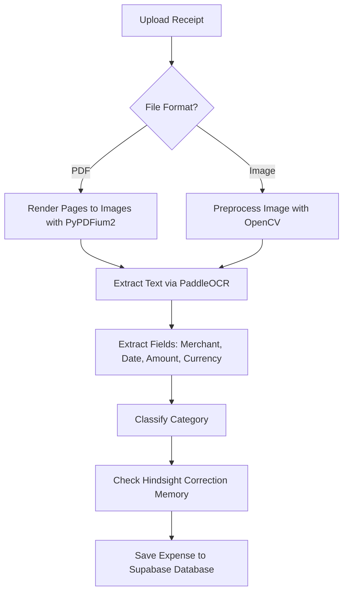
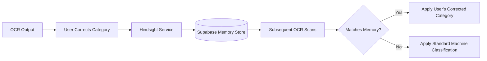
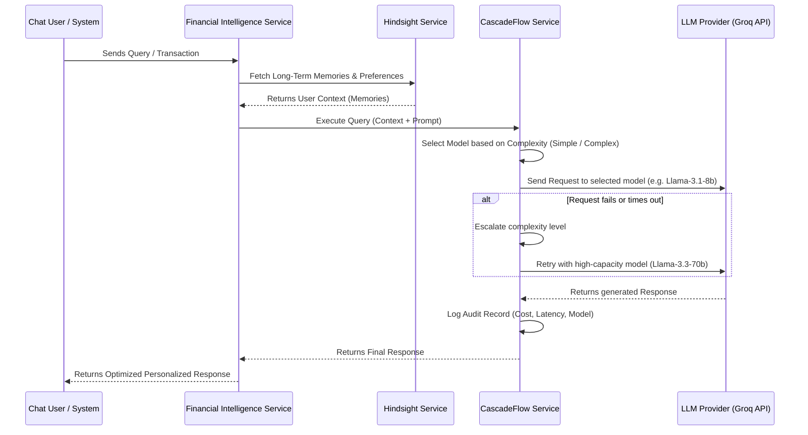

# Project Overview: UniFinance Expense Tracker

This document provides a comprehensive overview of the **UniFinance Expense Tracker** ecosystem. You can feed this file into any AI Chatbot to generate articles, documentation, or blog posts.

---

## 1. System Architecture & Tech Stack

The application follows a modern decoupled architecture designed for high availability, security, and fast client-side performance.

```
┌────────────────────────────────────────────────────────┐
│                   Next.js Frontend                     │
│  (React, TypeScript, Tailwind CSS / Vanilla CSS, SPA)  │
└───────────┬──────────────────────────────┬─────────────┘
            │ API Requests                 │ Fetch / Post
            ▼                              ▼
┌──────────────────────┐        ┌──────────────────────┐
│  Supabase Backend    │        │  FastAPI OCR Service │
│ (PostgreSQL, Auth,   │        │ (Python, PaddleOCR,  │
│  Database Triggers)  │        │  OpenCV, PyPDFium2)  │
└──────────────────────┘        └──────────────────────┘
```

### Frontend Stack

* **Framework**: Next.js (App Router, TypeScript)
* **Styling**: Vanilla CSS with custom theme variables / Tailwind CSS (dynamic, premium aesthetics, custom graphs)
* **State Management**: React Context (Financial Data Provider, Session Provider)

### Primary Backend Stack

* **Database & Auth**: Supabase (PostgreSQL) with native Row-Level Security (RLS) policies
* **ORM / Querying**: Supabase Client SDK

### Specialized AI & OCR Microservice

* **Framework**: FastAPI (Python 3.10) running on port `8000`
* **OCR Engine**: PaddleOCR (v3.7) with localized English recognition models
* **Document Rendering**: `pypdfium2` for rasterizing multipage PDF receipts
* **Image Processing**: OpenCV (`opencv-python-headless`) for image denoising, adaptive thresholding, and perspective-corrected auto-cropping.

---

## 2. Core Features & Functional Details

### A. Financial Intelligence & AI Chat Assistant (Hindsight + CascadeFlow Synergy)

* **AI Copilot**: An interactive chatbot integrated into the Next.js dashboard.
* **Hindsight Memory Retrieval**: Before any AI prompt runs, the system queries the `HindsightService` to fetch user preferences, feedback history, and custom OCR rules. This acts as a long-term context injection layer.
* **CascadeFlow Adaptive Execution**: The combined prompt and context are processed by `CascadeflowService`. It automatically evaluates complexity, routing simple requests to `llama-3.1-8b-instant` and complex ones to `llama-3.3-70b-versatile`, keeping costs low and latency minimal. If a simple execution fails or times out, it dynamically escalates the request to the high-capacity model.
* **Personalized Budgets**: Calculates dynamically adjusting spending categories and allocation rules based on income.
* **Savings Goal Allocations**: Configures target goals and tracks real-time progress by auto-allocating surplus cash.

### B. Advanced OCR Receipt Processing

Allows users to upload images (JPG, PNG, WEBP) or PDFs of their purchase receipts to automate expense logging.

* **Auto-Correction**: OpenCV detects document boundaries, crops the receipt, and normalizes contrast using CLAHE (Contrast Limited Adaptive Histogram Equalization).
* **Heuristics Extraction**:
  * **Merchant**: Top candidate lines analyzed against blocklisted common words (e.g., date, total, tel).
  * **Amount**: Searches for currency labels and takes the highest numeric float value as fallback.
  * **Currency**: Identifies codes (USD, AUD, INR) or symbols ($, ₹, €, £).
  * **Date**: Auto-parses standard dates (`YYYY-MM-DD`, `DD/MM/YYYY`, word months) or defaults to today's date.
* **Hindsight Learning System**: When users correct categories or merchant names predicted by the OCR, the system logs the adjustment to a user-specific OCR correction memory store. Subsequent OCR requests learn from these rules to personalize predictions.

### C. Multi-Source Financial Tracking

Transactions are not just manually input. They can flow from multiple channels:

* **Manual**: Hand-entered transactions.
* **OCR Receipts**: Scanned receipts.
* **SMS & Gmail Integrations**: Parses transaction notifications from emails/texts and categorizes them automatically.
* **Recurring Transactions**: Automatically generates future budget projections and records active recurring costs.

---

## 3. Database Schema & Data Models

The system runs on Supabase (PostgreSQL). Below are the primary tables:

### `profiles`

Tracks user settings, onboarded flags, and overall metadata.

* `id` (UUID, primary key)
* `home_currency` (text)
* `show_home_currency` (boolean)
* `ocr_imported_count` (integer)
* `onboarded` (boolean)

### `expenses`

Stores transaction records.

* `id` (UUID, primary key)
* `user_id` (UUID, foreign key)
* `amount` (numeric)
* `currency` (text)
* `merchant` (text)
* `category` (enum: Food, Transport, Subscriptions, Education, Shopping, Entertainment, Rent, Health, Misc)
* `date` (timestamp)
* `source` (enum: MANUAL, MESSAGE, OCR_RECEIPT, EMAIL, SMS, RECURRING)
* `ocr_confidence` (numeric, nullable)

### `incomes`

Tracks money flowing in.

* `id` (UUID, primary key)
* `user_id` (UUID, foreign key)
* `amount` (numeric)
* `source` (text)
* `date` (timestamp)

### `goal_allocations`

Allocates money towards savings targets.

* `id` (UUID, primary key)
* `goal_id` (UUID)
* `amount` (numeric)
* `allocation_date` (timestamp)

---

## 4. Key Diagrams You Can Add to the Article

When building your article or blog post, ask the AI to draw or describe the following diagrams:

### Diagram 1: OCR Pipeline Flowchart (Mermaid)

Showcases the receipt processing lifecycle from upload to database insertion.



### Diagram 2: Hindsight Service Architecture (Data Flow)

Shows how user corrections refine the OCR categorization engine over time.



### Diagram 3: Combined Copilot Processing (Hindsight + CascadeFlow)

Illustrates the end-to-end user query lifecycle combining long-term memory retrieval and optimized model routing.



